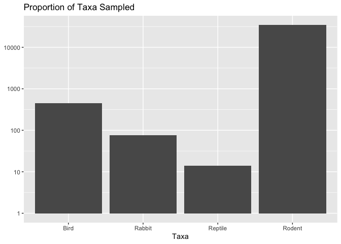
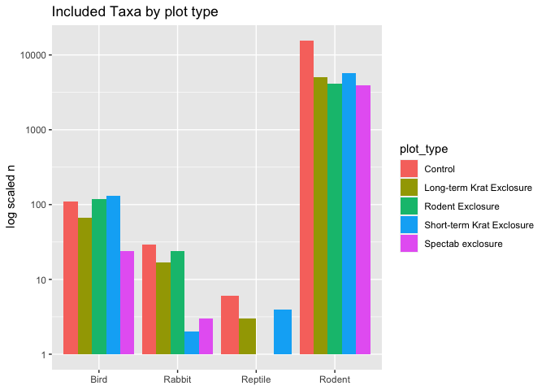
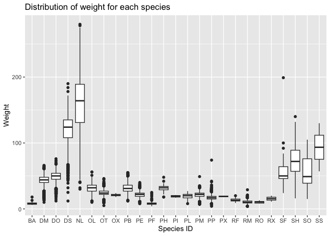
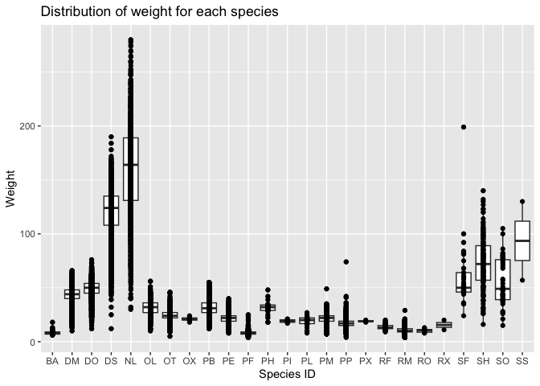
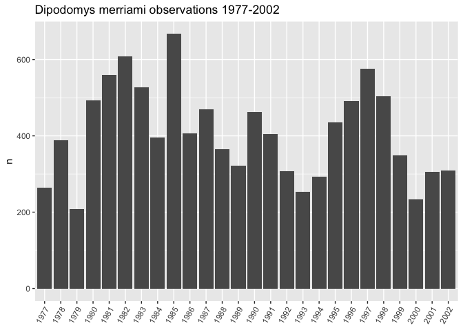
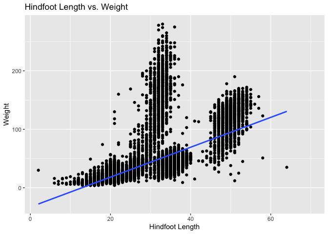
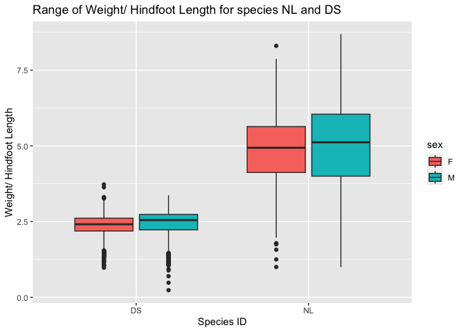
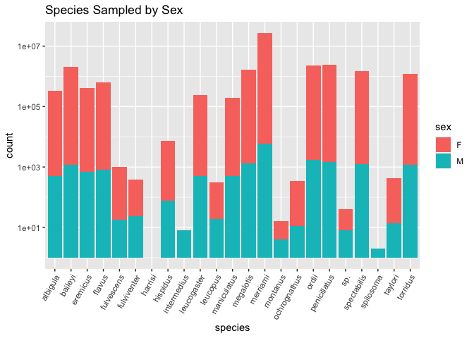

```r
getwd()
```

```
## [1] "/Users/isabellaszalay/Desktop/BIS15W2023_iszalay/lab10"
```

## Instructions
Answer the following questions and complete the exercises in RMarkdown. Please embed all of your code and push your final work to your repository. Your final lab report should be organized, clean, and run free from errors. Remember, you must remove the `#` for the included code chunks to run. Be sure to add your name to the author header above. For any included plots, make sure they are clearly labeled. You are free to use any plot type that you feel best communicates the results of your analysis.  

Make sure to use the formatting conventions of RMarkdown to make your report neat and clean!  

## Load the libraries

```r
library(tidyverse)
library(janitor)
library(here)
library(naniar)
```

## Desert Ecology
For this assignment, we are going to use a modified data set on [desert ecology](http://esapubs.org/archive/ecol/E090/118/). The data are from: S. K. Morgan Ernest, Thomas J. Valone, and James H. Brown. 2009. Long-term monitoring and experimental manipulation of a Chihuahuan Desert ecosystem near Portal, Arizona, USA. Ecology 90:1708.

```r
deserts <- read_csv(here("lab10", "data", "surveys_complete.csv"))
```

```
## Rows: 34786 Columns: 13
## ── Column specification ────────────────────────────────────────────────────────
## Delimiter: ","
## chr (6): species_id, sex, genus, species, taxa, plot_type
## dbl (7): record_id, month, day, year, plot_id, hindfoot_length, weight
## 
## ℹ Use `spec()` to retrieve the full column specification for this data.
## ℹ Specify the column types or set `show_col_types = FALSE` to quiet this message.
```

```r
deserts %>%
  select(species, plot_type)
```

```
## # A tibble: 34,786 × 2
##    species  plot_type                
##    <chr>    <chr>                    
##  1 albigula Control                  
##  2 albigula Long-term Krat Exclosure 
##  3 merriami Control                  
##  4 merriami Rodent Exclosure         
##  5 merriami Long-term Krat Exclosure 
##  6 flavus   Spectab exclosure        
##  7 eremicus Control                  
##  8 merriami Spectab exclosure        
##  9 merriami Spectab exclosure        
## 10 flavus   Short-term Krat Exclosure
## # … with 34,776 more rows
```

1. Use the function(s) of your choice to get an idea of its structure, including how NA's are treated. Are the data tidy?  


```r
glimpse(deserts)
```

```
## Rows: 34,786
## Columns: 13
## $ record_id       <dbl> 1, 2, 3, 4, 5, 6, 7, 8, 9, 10, 11, 12, 13, 14, 15, 16,…
## $ month           <dbl> 7, 7, 7, 7, 7, 7, 7, 7, 7, 7, 7, 7, 7, 7, 7, 7, 7, 7, …
## $ day             <dbl> 16, 16, 16, 16, 16, 16, 16, 16, 16, 16, 16, 16, 16, 16…
## $ year            <dbl> 1977, 1977, 1977, 1977, 1977, 1977, 1977, 1977, 1977, …
## $ plot_id         <dbl> 2, 3, 2, 7, 3, 1, 2, 1, 1, 6, 5, 7, 3, 8, 6, 4, 3, 2, …
## $ species_id      <chr> "NL", "NL", "DM", "DM", "DM", "PF", "PE", "DM", "DM", …
## $ sex             <chr> "M", "M", "F", "M", "M", "M", "F", "M", "F", "F", "F",…
## $ hindfoot_length <dbl> 32, 33, 37, 36, 35, 14, NA, 37, 34, 20, 53, 38, 35, NA…
## $ weight          <dbl> NA, NA, NA, NA, NA, NA, NA, NA, NA, NA, NA, NA, NA, NA…
## $ genus           <chr> "Neotoma", "Neotoma", "Dipodomys", "Dipodomys", "Dipod…
## $ species         <chr> "albigula", "albigula", "merriami", "merriami", "merri…
## $ taxa            <chr> "Rodent", "Rodent", "Rodent", "Rodent", "Rodent", "Rod…
## $ plot_type       <chr> "Control", "Long-term Krat Exclosure", "Control", "Rod…
```

```r
names(deserts)
```

```
##  [1] "record_id"       "month"           "day"             "year"           
##  [5] "plot_id"         "species_id"      "sex"             "hindfoot_length"
##  [9] "weight"          "genus"           "species"         "taxa"           
## [13] "plot_type"
```

```r
deserts
```

```
## # A tibble: 34,786 × 13
##    record…¹ month   day  year plot_id speci…² sex   hindf…³ weight genus species
##       <dbl> <dbl> <dbl> <dbl>   <dbl> <chr>   <chr>   <dbl>  <dbl> <chr> <chr>  
##  1        1     7    16  1977       2 NL      M          32     NA Neot… albigu…
##  2        2     7    16  1977       3 NL      M          33     NA Neot… albigu…
##  3        3     7    16  1977       2 DM      F          37     NA Dipo… merria…
##  4        4     7    16  1977       7 DM      M          36     NA Dipo… merria…
##  5        5     7    16  1977       3 DM      M          35     NA Dipo… merria…
##  6        6     7    16  1977       1 PF      M          14     NA Pero… flavus 
##  7        7     7    16  1977       2 PE      F          NA     NA Pero… eremic…
##  8        8     7    16  1977       1 DM      M          37     NA Dipo… merria…
##  9        9     7    16  1977       1 DM      F          34     NA Dipo… merria…
## 10       10     7    16  1977       6 PF      F          20     NA Pero… flavus 
## # … with 34,776 more rows, 2 more variables: taxa <chr>, plot_type <chr>, and
## #   abbreviated variable names ¹​record_id, ²​species_id, ³​hindfoot_length
```

data is tidy!!


2. How many genera and species are represented in the data? What are the total number of observations? Which species is most/ least frequently sampled in the study?


```r
deserts %>%
  count(species) %>%
  arrange(-n)
```

```
## # A tibble: 40 × 2
##    species          n
##    <chr>        <int>
##  1 merriami     10596
##  2 penicillatus  3123
##  3 ordii         3027
##  4 baileyi       2891
##  5 megalotis     2609
##  6 spectabilis   2504
##  7 torridus      2249
##  8 flavus        1597
##  9 eremicus      1299
## 10 albigula      1252
## # … with 30 more rows
```
40 species are represented in the data. Merriami is the most frequently sampled and clarki, scutalatus, tereticaudus, tigris, uniparens, and viridis are the least sampled.


```r
deserts %>%
  count(genus) %>%
  arrange(-n)
```

```
## # A tibble: 26 × 2
##    genus                n
##    <chr>            <int>
##  1 Dipodomys        16167
##  2 Chaetodipus       6029
##  3 Onychomys         3267
##  4 Reithrodontomys   2694
##  5 Peromyscus        2234
##  6 Perognathus       1629
##  7 Neotoma           1252
##  8 Ammospermophilus   437
##  9 Amphispiza         303
## 10 Spermophilus       249
## # … with 16 more rows
```
There are 26 genera.


```r
deserts %>% 
  n_distinct("species")
```

```
## [1] 34786
```
number of observations of species.


3. What is the proportion of taxa included in this study? Show a table and plot that reflects this count.

```r
deserts %>%
  tabyl(taxa)
```

```
##     taxa     n      percent
##     Bird   450 0.0129362387
##   Rabbit    75 0.0021560398
##  Reptile    14 0.0004024608
##   Rodent 34247 0.9845052607
```

```r
deserts %>%
  tabyl(taxa) %>%
  ggplot(aes(x=taxa, y=n)) +
  scale_y_log10()+
  geom_col()+
  labs(title = "Proportion of Taxa Sampled",
       x = "Taxa",
       y = NULL)
```

<!-- -->


4. For the taxa included in the study, use the fill option to show the proportion of individuals sampled by `plot_type.`

```r
deserts %>% 
  ggplot(aes(x=taxa, fill=plot_type)) + geom_bar(position="dodge") +
  scale_y_log10()+
  theme(axis.text.x = element_text(hjust = 0.5)) +
  labs(title = "Included Taxa by plot type",
       x = NULL,
       y= " log scaled n")
```

<!-- -->


5. What is the range of weight for each species included in the study? Remove any observations of weight that are NA so they do not show up in the plot.


```r
deserts %>%
  select(species, species_id, weight, hindfoot_length) %>%
  group_by(species_id) %>% 
  filter(weight!= "NA")%>%
  summarise(min_weight = min(weight),
            max_weight = max(weight))
```

```
## # A tibble: 25 × 3
##    species_id min_weight max_weight
##    <chr>           <dbl>      <dbl>
##  1 BA                  6         18
##  2 DM                 10         66
##  3 DO                 12         76
##  4 DS                 12        190
##  5 NL                 30        280
##  6 OL                 10         56
##  7 OT                  5         46
##  8 OX                 18         24
##  9 PB                 12         55
## 10 PE                  8         40
## # … with 15 more rows
```


```r
deserts %>%
  filter(weight!= "NA")%>%
  ggplot(aes(x=species_id, y=weight)) +
  geom_boxplot()+
  labs(title = "Distribution of weight for each species",
       x = "Species ID",
       y = "Weight")
```

<!-- -->


6. Add another layer to your answer from #4 using `geom_point` to get an idea of how many measurements were taken for each species.


```r
deserts %>%
  filter(weight!= "NA")%>%
  ggplot(aes(x=species_id, y=weight)) +
  geom_boxplot()+
  geom_point()+
  labs(title = "Distribution of weight for each species",
       x = "Species ID",
       y = "Weight")
```

<!-- -->


7. [Dipodomys merriami](https://en.wikipedia.org/wiki/Merriam's_kangaroo_rat) is the most frequently sampled animal in the study. How have the number of observations of this species changed over the years included in the study?

```r
deserts %>% 
  filter(species_id=="DM") %>% 
  group_by(year) %>% 
  summarize(n_samples=n()) %>% 
  ggplot(aes(x=as.factor(year), y=n_samples)) + geom_col()+
  theme(axis.text.x = element_text(angle = 60, hjust = 1)) +
  labs(title = "Dipodomys merriami observations 1977-2002",
       x = NULL,
       y= "n")
```

<!-- -->


8. What is the relationship between `weight` and `hindfoot` length? Consider whether or not over plotting is an issue.

```r
deserts %>%
   ggplot(aes(x=hindfoot_length, y=weight)) + 
  geom_point(na.rm=T) +
  geom_smooth(method = lm, se=T)+
  labs(title = "Hindfoot Length vs. Weight",
       x = "Hindfoot Length",
       y = "Weight")
```

```
## `geom_smooth()` using formula = 'y ~ x'
```

```
## Warning: Removed 4048 rows containing non-finite values (`stat_smooth()`).
```

<!-- -->
There is so much overplotting in this graph that it is hard to tell how many data points are in each region in the plot.


9. Which two species have, on average, the highest weight? Once you have identified them, make a new column that is a ratio of `weight` to `hindfoot_length`. Make a plot that shows the range of this new ratio and fill by sex.


```r
deserts %>%
  select(species, species_id, weight, hindfoot_length) %>%
  filter(weight!= "NA") %>%
  group_by(species_id)%>%
  summarise(mean_weight = mean(weight)) %>%
  arrange(-mean_weight) %>%
  head(2)
```

```
## # A tibble: 2 × 2
##   species_id mean_weight
##   <chr>            <dbl>
## 1 NL                159.
## 2 DS                120.
```


```r
deserts %>% 
  filter(species_id=="NL" | species_id=="DS") %>% 
  filter(weight!="NA" & hindfoot_length!="NA" & sex!="NA") %>% 
  mutate(ratio=weight/hindfoot_length) %>% 
  select(species_id, sex, weight, hindfoot_length, ratio) %>% 
  ggplot(aes(x=species_id, y=ratio, fill=sex)) + geom_boxplot()+
  labs(title = "Range of Weight/ Hindfoot Length for species NL and DS",
       x = "Species ID",
       y = "Weight/ Hindfoot Length")
```

<!-- -->


10. Make one plot of your choice! Make sure to include at least two of the aesthetics options you have learned.


```r
deserts %>% 
  filter(sex!= "NA") %>%
  ggplot(aes(x=species, fill=sex)) + geom_bar() +
  scale_y_log10() +
  theme(axis.text.x = element_text(hjust = 0.5)) +
  theme(axis.text.x = element_text(angle = 60, hjust = 1)) +
  labs(title = "Species Sampled by Sex")
```

<!-- -->


## Push your final code to GitHub!
Please be sure that you check the `keep md` file in the knit preferences. 
